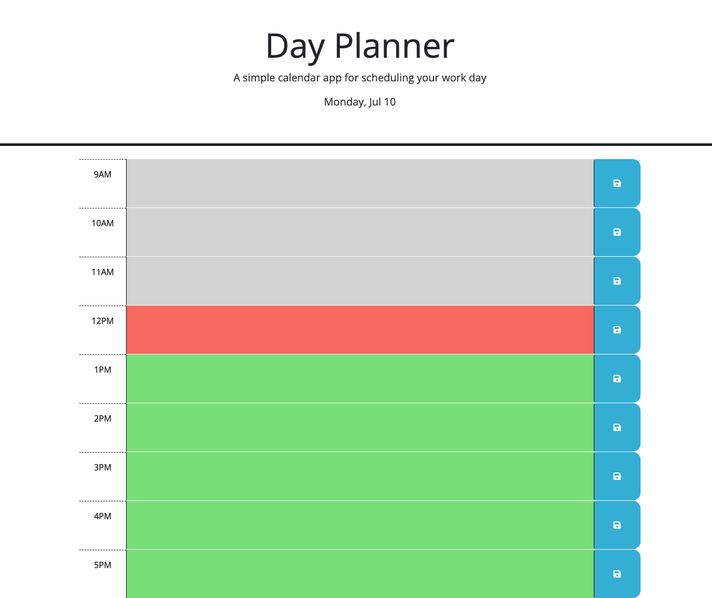

# Day-Planner

## Description

The Day Planner is a user-friendly web application designed to help you organize your daily tasks and manage your time effectively. Whether you're a student, professional, or someone who simply wants to stay organized, this planner provides a convenient way to plan and track your daily activities.

Features
Hourly Blocks: The Day Planner is divided into hourly blocks, allowing you to schedule your tasks throughout the day. Each hour is clearly labeled, providing a clear overview of your day.

Color-Coded Time Blocks: The current hour block is highlighted in red, making it easy to identify the present moment. Past hours are displayed in grey, while future hours are shown in green, providing a visual representation of your day at a glance.

Text Input: You can add your tasks and notes directly into the hour blocks. Simply click on the desired hour, and a text input field will appear. Type in your task and press enter to save it.

Local Storage: Your planner data is automatically saved to your browser's local storage, ensuring that your tasks are always accessible even if you close the website or refresh the page. This allows you to seamlessly resume your planning from where you left off.

## Display

## Usage

[Day-planner Website](https://justinryan8828.github.io/Day-Planner/)
